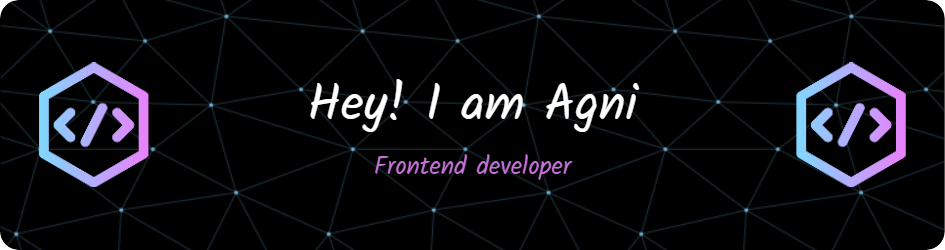

<h2 align="left">Hi 👋! My name is Agnibrata and I'm a  passionate front end developer in crafting dynamic, user-friendly web interfaces.</h2>

* 🖥️  See my portfolio at [https://agni-portfolio.vercel.app/](https://agni-portfolio.vercel.app/)
* ✉️  You can contact me at [agnibratashee@gmail.com](mailto:agnibratashee@gmail.com)
* 🧠  I'm learning graphql , node js , prisma
* ⚡  A passionate Front-End Developer willing to learn new technologies in crafting dynamic, user-friendly web interfaces.

###
# Tech Stack and Tools

## Frontend Development

  
  
  
  
  
  
  
  
  
  
  
  
  

###
## Frontend Libraries and Frameworks

  
  
  
  
  
  
  
  </a>

###
## Backend Frameworks and Tools

  
  
  
  
  
  
  
  
  
  
  

###

###
## IDE and Other Tools

  
  
  
  
  
  
  

###
## Find Me In

  
  
  
  

###

###

  
  
  
  
  
  

###
<b>My GitHub Stats</b>

###

